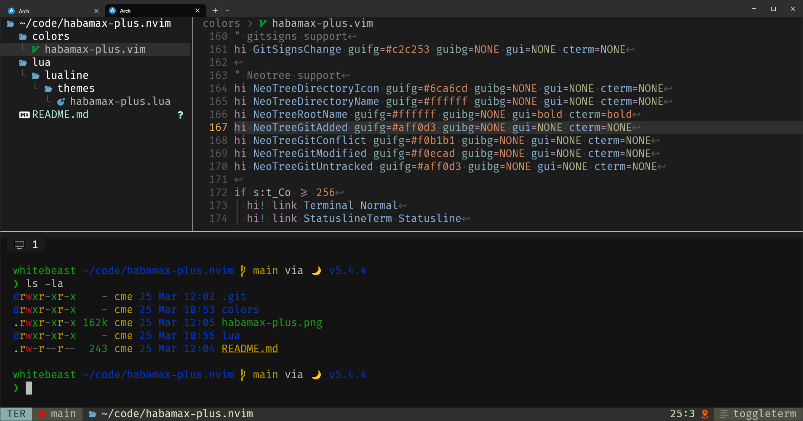

# habamax-plus.nvim

Variant of the [habamax](https://github.com/habamax/vim-habamax) colorscheme including basic support
for some common plugins, paired with a variant of the [seol256](https://github.com/nvim-lualine/lualine.nvim/blob/master/lua/lualine/themes/seoul256.lua) lualine theme.

